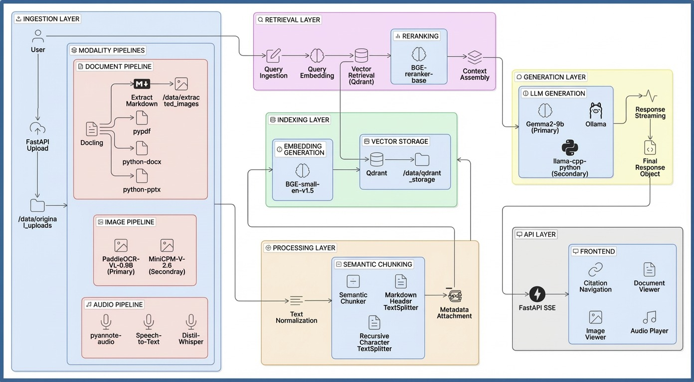

# Multimodal RAG System V2

> A fully offline, GPU-accelerated Retrieval-Augmented Generation platform supporting documents, images, and audio — built for privacy-first enterprise use on consumer hardware.


---

## Table of Contents

- [Overview](#overview)
- [Key Features & MVP](#key-features--mvp)
- [System Architecture](#system-architecture)
- [Tech Stack](#tech-stack)
- [Project Workflow](#project-workflow)
- [Project Structure](#project-structure)
- [Getting Started](#getting-started)
- [API Reference](#api-reference)
- [Frontend Pages](#frontend-pages)
- [Configuration](#configuration)
- [Hardware Requirements](#hardware-requirements)

---

## Overview

This system enables users to upload documents (PDF, DOCX, PPTX), images (PNG, JPG, WEBP), and audio files (MP3, WAV, M4A, OGG, FLAC), then ask natural-language questions that are answered by a locally-running LLM grounded purely in the uploaded content. Everything runs **100% offline** — no data leaves the machine.

### What Makes This Different

- **Truly offline** — no cloud APIs, no internet required after setup
- **Multimodal** — text, image OCR, audio transcription, and CLIP visual search in one pipeline
- **Sophisticated retrieval** — 4-stage hybrid pipeline (Vector + BM25 → RRF → entity injection → linked expansion → CLIP → reranking)
- **Full observability** — survival tracking, failure diagnosis, experiment lab, cost tracking, hallucination detection
- **Runs on a GTX 1650** — optimized for 4GB VRAM with KV cache quantization

---

## Key Features & MVP

### Core RAG Pipeline
| Feature | Description |
|---------|-------------|
| **Document Ingestion** | PDF, DOCX, PPTX parsed via Docling → Markdown → normalized → chunked |
| **Image Ingestion** | EasyOCR extracts text + CLIP ViT-B/32 generates 512-dim visual embeddings |
| **Audio Ingestion** | Faster-Whisper (small, int8) transcribes speech with VAD filtering |
| **Sliding Window Chunking** | 480 target / 512 max tokens, 50-token overlap, sentence-boundary aware, markdown header preservation |
| **Hybrid Retrieval** | Parallel Vector (Qdrant) + BM25 (rank-bm25) search with Reciprocal Rank Fusion (k=60) |
| **Cross-Encoder Reranking** | BGE-reranker-base scores top-15 candidates, drops below 0.15 threshold (min 5 safeguard) |
| **LLM Generation** | Qwen2.5-1.5B-Instruct Q4_K_M via llama.cpp, streaming SSE, deterministic sampling |
| **Citations** | Every answer links back to source documents with page numbers, timestamps, and speakers |

### Advanced Retrieval Features
| Feature | Description |
|---------|-------------|
| **Entity Injection** | Extracts acronyms, proper nouns, quoted terms from queries and injects matching chunks into RRF |
| **Cross-Modal Chunk Linking** | Cosine similarity + timestamp overlap + source bundle grouping creates `related_chunk_ids` for expansion |
| **CLIP Visual Search** | Keyword-gated image branch — CLIP text→image search when visual intent detected in query |
| **Image-as-Query** | Upload an image to query — CLIP encodes it, finds visually similar content, falls back to OCR |
| **Audio-as-Query** | Record/upload audio → Whisper transcribes → standard text query pipeline |
| **Adaptive Linking Threshold** | Analyzes embedding similarity distribution, falls back to p75 if configured threshold exceeds p90 |
| **Query Cache** | Thread-safe LRU cache (128 entries, 5-min TTL) — skips retrieval + LLM on repeated queries |

### Observability & Business Metrics
| Feature | Description |
|---------|-------------|
| **Confidence Scoring** | 4-signal weighted score: reranker quality (45%), source diversity (25%), coverage ratio (15%), modality consistency (15%) |
| **Hallucination Detection** | Token-overlap grounding check — flags ungrounded sentences with risk levels (low/medium/high) |
| **Cost Tracking** | Per-query resource accounting: tokens, GPU time, estimated USD cost |
| **Survival Tracker** | Traces each chunk through every pipeline stage (Vector → BM25 → RRF → Entity → Linked → Image → Rerank → Final) |
| **Failure Diagnosis** | Automated root-cause classification: corpus_gap, embedding_mismatch, rerank_threshold, rrf_dilution, parameter_issue |
| **Corpus Coverage** | Finds dead zones (never-retrieved chunks), hotspots, and per-source coverage rates |
| **Embedding Quality** | L2 norm stats, cosine similarity distribution, outlier detection (2σ) |
| **Experiment Engine** | A/B parameter comparison with Jaccard similarity, rank correlation, batch recall@k/MRR |

### Frontend
| Feature | Description |
|---------|-------------|
| **Chat Interface** | SSE streaming with 60ms token batching, debug panel, markdown rendering, citation navigation |
| **Upload Page** | Drag-and-drop multi-file uploader with progress tracking and status polling |
| **Knowledge Base** | Document management — list, view chunks, delete, re-index with analytics |
| **System Dashboard** | 4-tab view: overview, metrics (latency P50/P95), resource monitoring (GPU/CPU/RAM), index versions |
| **Query History** | Paginated log with expandable detail, latency breakdown, recall validation annotations |
| **Failure Diagnosis** | Root-cause analysis, batch diagnosis distribution, corpus coverage, embedding quality checks |
| **Experiment Lab** | Side-by-side A/B parameter comparison and batch evaluation with ground truth |
| **PDF/Audio/Image Viewers** | In-browser viewers with zoom, page navigation, seek, keyboard shortcuts |

---

## System Architecture


*Figure: System Design Architecture of the Multimodal RAG System V2*

```
┌─────────────────────────────────────────────────────────────────────────┐
│                        React 18 Frontend (Vite)                         │
│  Chat │ Upload │ Knowledge Base │ Dashboard │ History │ Research Lab     │
└────────────────────────────────┬────────────────────────────────────────┘
                                 │ HTTP / SSE
┌────────────────────────────────▼────────────────────────────────────────┐
│                      FastAPI Backend (uvicorn)                           │
│                                                                         │
│  ┌──────────┐  ┌──────────────────────────────────────────────────────┐ │
│  │  Upload   │  │              Query Pipeline                         │ │
│  │  ├ Docling │  │                                                     │ │
│  │  ├ EasyOCR │  │  Query → Normalize → Embed (BGE) ──┐               │ │
│  │  ├ Whisper │  │                                     │               │ │
│  │  └ CLIP    │  │  ┌──────────────────────────────────▼────────────┐  │ │
│  └──────────┘  │  │         Hybrid Retriever                       │  │ │
│                │  │  Vector Search (Qdrant) ──┐                    │  │ │
│                │  │  BM25 Search ─────────────┤  RRF Fusion (k=60) │  │ │
│                │  │  Entity Injection ────────┤                    │  │ │
│                │  │  Linked Expansion ────────┤                    │  │ │
│                │  │  CLIP Image Branch ───────┘                    │  │ │
│                │  └──────────────────────────────────┬─────────────┘  │ │
│                │                                     │                │ │
│                │  Cross-Encoder Reranking (BGE) ◄────┘                │ │
│                │           │                                          │ │
│                │  Prompt Builder (context budget) → LLM (Qwen2.5)    │ │
│                │           │                                          │ │
│                │  SSE Stream → Confidence → Hallucination → Cost      │ │
│                └──────────────────────────────────────────────────────┘ │
│                                                                         │
│  ┌──────────────────────────────────────────────────────────────────┐   │
│  │                      Observability Layer                         │   │
│  │  Metrics │ Analytics │ Query Store │ Survival │ Diagnosis │ Cost │   │
│  └──────────────────────────────────────────────────────────────────┘   │
└─────────────────────────────────────────────────────────────────────────┘
         │                           │
    ┌────▼────┐               ┌──────▼──────┐
    │  Qdrant  │               │  Local FS   │
    │ :6333    │               │  (indexes,  │
    │ 384-dim  │               │   uploads,  │
    │ 512-dim  │               │   logs)     │
    └──────────┘               └─────────────┘
```

---

## Tech Stack

### Backend
| Component | Technology | Details |
|-----------|-----------|---------|
| Framework | FastAPI + uvicorn | Async HTTP + SSE streaming |
| LLM | Qwen2.5-1.5B-Instruct Q4_K_M | llama-cpp-python, full GPU offload, KV cache q8_0 |
| Embeddings | BGE-small-en-v1.5 | 384-dim, CUDA, sentence-transformers |
| Reranker | BGE-reranker-base | Cross-encoder on CPU |
| Visual Search | CLIP ViT-B/32 | 512-dim, separate Qdrant collection |
| Vector DB | Qdrant | HNSW m=16, ef_construct=100, Cosine distance |
| Keyword Search | rank-bm25 (BM25Okapi) | Pickle-serialized index with checksum validation |
| Document Parsing | Docling | PDF/DOCX/PPTX → Markdown |
| OCR | EasyOCR | English, CPU, confidence threshold 0.70 |
| Speech-to-Text | faster-whisper (small) | CTranslate2 int8, VAD filter |
| Config | YAML + env overrides | `RAG_SECTION__KEY=value` pattern |

### Frontend
| Component | Technology |
|-----------|-----------|
| Framework | React 18.3.1 + TypeScript 5.6 |
| Build Tool | Vite 6 |
| Styling | TailwindCSS 3.4 |
| HTTP Client | Axios (REST) + fetch (SSE) |
| Markdown | react-markdown + remark-gfm + rehype-sanitize |
| PDF Viewer | pdfjs-dist (canvas rendering) |
| Icons | lucide-react |
| Routing | react-router-dom 6 |

---

## Project Workflow

### 1. Document Ingestion Pipeline

```
User uploads file
       │
       ▼
  Detect Modality (extension-based)
       │
       ├── Document (.pdf, .docx, .pptx)
       │     └── Docling DocumentConverter → Markdown
       │
       ├── Image (.png, .jpg, .webp)
       │     ├── EasyOCR → text blocks with bounding boxes
       │     └── CLIP ViT-B/32 → 512-dim visual embedding → image_visual_embeddings collection
       │
       └── Audio (.mp3, .wav, .m4a, .ogg, .flac)
             └── Faster-Whisper → timestamped transcript segments
       │
       ▼
  Normalize Text (NFC unicode, quotes, dashes, whitespace)
       │
       ▼
  Sliding Window Chunker
  (480 target tokens, 512 max, 50 overlap, sentence-boundary aware)
       │
       ▼
  BGE-small-en-v1.5 Embedding (384-dim, CUDA, normalized)
       │
       ▼
  Upsert to Qdrant (rag_chunks collection)
       │
       ▼
  Rebuild BM25 Index (global, from all Qdrant chunks)
       │
       ▼
  Cross-Modal Chunk Linking
  (cosine similarity + timestamp overlap + source bundle → related_chunk_ids)
```

### 2. Query Pipeline

```
User submits question
       │
       ▼
  Normalize Query → Cache Lookup
       │                │
       │           Cache HIT → Stream cached answer (skip retrieval + LLM)
       │
       ▼ Cache MISS
  BGE Query Embedding (with "Represent this sentence..." prefix)
       │
       ▼
  ┌─────────────────────────────────────────────────────────┐
  │              Hybrid Retriever                            │
  │                                                          │
  │  Stage 1: Parallel Search                                │
  │    ├── Vector Search (Qdrant, top-50)                    │
  │    └── BM25 Search (top-50)                              │
  │                                                          │
  │  Stage 2a: RRF Fusion (k=60)                             │
  │    └── score = Σ [1/(k + rank)], deduplicate by chunk_id │
  │                                                          │
  │  Stage 2b: Entity Injection                              │
  │    └── Extract acronyms/proper nouns → BM25 lookup       │
  │                                                          │
  │  Stage 2c: Linked Chunk Expansion                        │
  │    └── Expand via related_chunk_ids (0.9x penalty)       │
  │                                                          │
  │  Stage 2d: CLIP Image Branch (if visual intent detected) │
  │    └── CLIP text → image_visual_embeddings search        │
  │                                                          │
  │  Stage 3: Cross-Encoder Reranking (top-15 candidates)    │
  │    └── BGE-reranker-base, threshold 0.15, min 5 results  │
  └─────────────────────────────────────────────────────────┘
       │
       ▼
  Build Prompt (context budget = n_ctx - max_gen - 64)
  (ChatML format, context trimmed line-by-line to fit)
       │
       ▼
  LLM Streaming Generation (Qwen2.5-1.5B, top_k=1)
       │
       ▼
  Post-Processing
    ├── Truncation detection (finish_reason == "length")
    ├── Summary fallback (extract last sentence if model didn't produce one)
    ├── Confidence scoring (4-signal weighted)
    ├── Hallucination detection (token-overlap grounding)
    ├── Cost tracking (tokens + GPU time + estimated USD)
    └── Citations (source, page, speaker, timestamp, file_id)
       │
       ▼
  SSE Stream to Frontend
  (status → tokens → citations → meta{confidence, cost, hallucination} → done)
       │
       ▼
  Cache Store + Query History Record
```

### 3. Observability Workflow

```
Every Query
    │
    ├── Metrics Collection (latency histograms, counters)
    ├── Analytics Tracking (per-document retrieval frequency)
    ├── Query Store (JSONL append-only, 500-record cap)
    └── Cache Stats (hit rate, evictions)

Debug Mode (debug=true)
    │
    ├── Survival Tracker
    │     └── Per-chunk journey: Vector → BM25 → RRF → Entity → Linked → Image → Rerank → Final
    │
    ├── Failure Diagnosis
    │     └── Root cause: corpus_gap | embedding_mismatch | rerank_threshold | rrf_dilution
    │
    └── Full Debug SSE Event (all results at every stage with scores/ranks/origins)

Research Lab
    │
    ├── Corpus Coverage Analysis (dead zones, hotspots, per-source coverage)
    ├── Embedding Quality Check (norms, cosine stats, outliers)
    ├── A/B Experiment Comparison (Jaccard, rank correlation, score diff)
    └── Batch Evaluation (recall@5, recall@10, MRR with ground truth)
```

---

## Project Structure

```
Offline_Rag_V2/
│
├── rag-system/                      # Backend (FastAPI)
│   ├── config.yaml                  # Master configuration
│   ├── requirements.txt             # Python dependencies
│   ├── app/
│   │   ├── main.py                  # FastAPI entry + lifespan
│   │   ├── api/
│   │   │   ├── routes.py            # All API endpoints
│   │   │   ├── models.py            # Pydantic request/response schemas
│   │   │   └── dependencies.py      # Singleton DI via @lru_cache
│   │   ├── config/
│   │   │   ├── settings.py          # YAML + env config loader
│   │   │   └── runtime_settings.py  # Mutable runtime overrides
│   │   ├── ingestion/
│   │   │   ├── document_worker.py   # Docling PDF/DOCX/PPTX → Markdown
│   │   │   ├── ocr_worker.py        # EasyOCR image → text blocks
│   │   │   ├── audio_worker.py      # Faster-Whisper → transcript
│   │   │   └── workers.py           # Modality detection & validation
│   │   ├── processing/
│   │   │   ├── chunking.py          # Sliding window chunker
│   │   │   ├── normalization.py     # Unicode normalization
│   │   │   └── validators.py        # Token & metadata validation
│   │   ├── retrieval/
│   │   │   ├── hybrid_retriever.py  # Vector + BM25 + RRF + reranking
│   │   │   ├── vector_store.py      # Qdrant wrapper
│   │   │   ├── bm25_store.py        # BM25Okapi index
│   │   │   ├── reranker.py          # BGE cross-encoder
│   │   │   ├── entity_extractor.py  # Regex entity extraction
│   │   │   ├── chunk_linker.py      # Cross-modal linking
│   │   │   ├── visual_intent_detector.py  # CLIP gating
│   │   │   ├── image_visual_store.py      # CLIP Qdrant collection
│   │   │   ├── image_query_retriever.py   # Image-as-query pipeline
│   │   │   ├── confidence.py        # Confidence scoring
│   │   │   ├── hallucination.py     # Grounding verification
│   │   │   └── query_cache.py       # LRU query cache
│   │   ├── generation/
│   │   │   ├── llm_engine.py        # llama.cpp wrapper
│   │   │   ├── prompt_templates.py  # ChatML prompt builder
│   │   │   └── slm_engine.py        # Optional SLM for query rewrite
│   │   ├── models/
│   │   │   ├── model_manager.py     # Lazy model loading
│   │   │   ├── model_registry.py    # Model metadata registry
│   │   │   ├── embeddings.py        # BGE embedding wrapper
│   │   │   └── clip_encoder.py      # CLIP image/text encoder
│   │   ├── observability/
│   │   │   ├── metrics.py           # Counter/Histogram/Gauge
│   │   │   ├── analytics.py         # Per-document retrieval stats
│   │   │   ├── query_store.py       # JSONL query history
│   │   │   ├── cost_tracker.py      # Per-query cost accounting
│   │   │   ├── survival_tracker.py  # Chunk pipeline journey
│   │   │   ├── failure_diagnosis.py # Root-cause classifier
│   │   │   ├── corpus_coverage.py   # Dead zone analysis
│   │   │   ├── embedding_quality.py # Vector health diagnostics
│   │   │   ├── file_registry.py     # Upload file tracking
│   │   │   ├── business_impact.py   # ROI estimation
│   │   │   └── logging_config.py    # JSON structured logging
│   │   ├── experimentation/
│   │   │   └── experiment_engine.py # A/B testing + batch eval
│   │   └── versioning/
│   │       ├── index_manager.py     # Symlink-based version switching
│   │       └── checksum.py          # Qdrant↔BM25 consistency
│   ├── data/                        # Runtime data
│   │   ├── uploads/                 # Uploaded files
│   │   ├── index/                   # BM25 + Qdrant indexes
│   │   └── logs/                    # Structured JSON logs
│   └── scripts/
│       ├── download_models.py
│       ├── health_check.py
│       └── init_index.py
│
├── frontend/                        # React 18 + TypeScript + Vite
│   └── src/
│       ├── app/                     # App shell, routes
│       ├── features/
│       │   ├── chat/                # Chat + debug panel + viewers
│       │   ├── upload/              # Drag-and-drop uploader
│       │   ├── knowledge/           # Knowledge base management
│       │   ├── dashboard/           # System status (4 tabs)
│       │   ├── history/             # Query history + recall validation
│       │   ├── diagnosis/           # Failure diagnosis (4 tabs)
│       │   └── experiments/         # A/B comparison + batch eval
│       └── shared/                  # Hooks, types, components, API
│
├── models/                          # ML models (not in git)
│   ├── embeddings/bge-small-en-v1.5/
│   ├── reranker/bge-reranker-base/
│   ├── llm/qwen2.5-1.5b-instruct-q4_k_m.gguf
│   ├── whisper/faster-whisper-small/
│   └── ocr/paddleocr/
│
└── docker/
    ├── Dockerfile
    └── docker-compose.yml
```

---

## Getting Started

### Prerequisites

- **Python 3.11+**
- **Node.js 18+** (for frontend)
- **Qdrant** running on `localhost:6333`
- **NVIDIA GPU** with CUDA (optional — CPU mode supported)

### 1. Clone & Setup Python Environment

```bash
git clone https://github.com/Aathi-27/Multimodal-Rag-system-V2.git
cd Multimodal-Rag-system-V2

python -m venv .venv
# Windows
.venv\Scripts\activate
# Linux/Mac
source .venv/bin/activate

cd rag-system
pip install -r requirements.txt
```

### 2. Download Models

Place models in the `models/` directory:

| Model | Size | Path |
|-------|------|------|
| Qwen2.5-1.5B-Instruct Q4_K_M | ~1.1 GB | `models/llm/qwen2.5-1.5b-instruct-q4_k_m.gguf` |
| BGE-small-en-v1.5 | ~130 MB | `models/embeddings/bge-small-en-v1.5/` |
| BGE-reranker-base | ~1.1 GB | `models/reranker/bge-reranker-base/` |
| Faster-Whisper small | ~460 MB | `models/whisper/faster-whisper-small/` |
| CLIP ViT-B/32 | ~340 MB | Auto-downloads on first use |

### 3. Start Qdrant

```bash
docker run -d -p 6333:6333 -v qdrant_storage:/qdrant/storage qdrant/qdrant:latest
```

### 4. Start Backend

```bash
cd rag-system
uvicorn app.main:app --host 0.0.0.0 --port 8000
```

### 5. Start Frontend

```bash
cd frontend
npm install
npm run dev
```

Open http://localhost:5173

---

## API Reference

### Core Endpoints

| Method | Path | Description |
|--------|------|-------------|
| `POST` | `/upload` | Upload document/image/audio (202 Accepted) |
| `POST` | `/query` | Text query with SSE streaming response |
| `POST` | `/query/image` | Image-as-query (CLIP + OCR fallback) |
| `POST` | `/query/audio` | Audio-as-query (Whisper → text pipeline) |
| `GET` | `/health` | System health (all subsystems) |
| `GET` | `/status/{task_id}` | Upload processing status |

### Knowledge Base

| Method | Path | Description |
|--------|------|-------------|
| `GET` | `/documents` | List all indexed documents |
| `GET` | `/documents/{source}/chunks` | View chunks for a document |
| `DELETE` | `/documents/{source}` | Delete document + rebuild BM25 |
| `POST` | `/documents/{source}/reindex` | Re-index from original file |

### Observability

| Method | Path | Description |
|--------|------|-------------|
| `GET` | `/metrics` | Latency histograms, counters |
| `GET` | `/resources` | CPU, RAM, GPU, disk usage |
| `GET` | `/analytics` | Per-document retrieval stats |
| `GET` | `/queries` | Paginated query history |
| `GET` | `/index/health` | Index statistics |

### Research Lab

| Method | Path | Description |
|--------|------|-------------|
| `GET` | `/queries/{id}/survival` | Chunk survival analysis |
| `GET` | `/queries/{id}/diagnosis` | Root-cause failure diagnosis |
| `POST` | `/experiment/compare` | A/B parameter comparison |
| `POST` | `/experiment/batch` | Batch evaluation with ground truth |
| `GET` | `/corpus/coverage` | Corpus coverage analysis |
| `GET` | `/embeddings/quality` | Embedding health check |

### Settings

| Method | Path | Description |
|--------|------|-------------|
| `GET` | `/settings/retrieval` | Current retrieval parameters |
| `PATCH` | `/settings/retrieval` | Runtime parameter overrides |
| `DELETE` | `/settings/retrieval` | Reset to config.yaml defaults |

---

## Frontend Pages

| Page | Description |
|------|-------------|
| **Chat** | Main query interface with SSE streaming, 3-mode input (text/image/audio), debug panel, citation viewers |
| **Upload** | Drag-and-drop multi-file upload with progress tracking and ingestion status |
| **Knowledge Base** | Document table with search, analytics, chunk inspection, delete, re-index |
| **System Status** | Overview, metrics (P50/P95 latencies), resource monitoring, index version management |
| **Query History** | Chronological query log with latency breakdown, recall validation annotations |
| **Failure Diagnosis** | Root-cause analysis, batch diagnosis, corpus coverage, embedding quality |
| **Experiment Lab** | A/B parameter comparison and batch evaluation with Recall@K, MRR metrics |

---

## Configuration

All settings are in `rag-system/config.yaml`. Override any value via environment variables:

```bash
RAG_LLM__GPU_LAYERS=0           # CPU-only mode
RAG_LLM__MAX_NEW_TOKENS=1024    # Longer responses
RAG_RETRIEVAL__RRF_K=80         # Tune RRF constant
RAG_QDRANT__HOST=qdrant         # Docker service name
```

Runtime overrides (no restart needed):
```bash
# Via API
curl -X PATCH http://localhost:8000/settings/retrieval \
  -H "Content-Type: application/json" \
  -d '{"rrf_k": 80, "rerank_threshold": 0.20}'
```

### Key Configuration Sections

| Section | Key Settings |
|---------|-------------|
| `chunking` | target_tokens: 480, max_tokens: 512, overlap: 50 |
| `retrieval` | vector_top_k: 50, bm25_top_k: 50, rrf_k: 60, rerank_count: 10, rerank_threshold: 0.15 |
| `llm` | context_window: 4096, max_new_tokens: 768, gpu_layers: -1, temperature: 0.3 |
| `clip` | enabled: true, device: cpu, max_image_results: 5, modality_penalty: 0.95 |
| `linking` | max_related_per_chunk: 3, expansion_penalty: 0.9, similarity_threshold: 0.70 |
| `qdrant` | vector_size: 384, hnsw_m: 16, hnsw_ef_construct: 100 |

---

## Hardware Requirements

### Minimum (tested on)
| Resource | Spec |
|----------|------|
| GPU | NVIDIA GTX 1650 (4GB VRAM) |
| RAM | 16 GB |
| Disk | SSD (models + indexes ~4 GB) |
| CPU | 8 threads |

### GPU Memory Breakdown (GTX 1650)
| Component | VRAM |
|-----------|------|
| Qwen2.5-1.5B Q4_K_M | ~1.2 GB |
| KV Cache (q8_0 quantized) | ~0.5 GB (saved ~60 MiB vs f16) |
| BGE-small-en-v1.5 embeddings | ~0.3 GB |
| CUDA overhead | ~0.5 GB |
| **Total** | **~2.5 GB / 4 GB** |

### CPU-Only Mode

Set `gpu_layers: 0` in `config.yaml`. All models run on CPU with:
- Reranker: always CPU
- CLIP: always CPU (configurable)
- Whisper: always CPU (int8)
- EasyOCR: always CPU

---

## License

MIT
